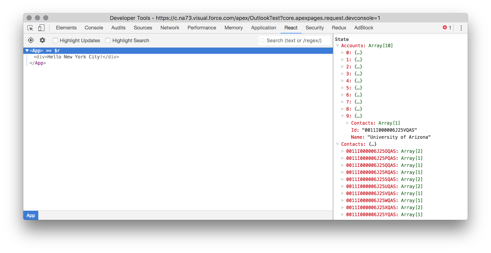

# React in Salesforce

Presented to the New York Salesforce Developer User Group in October 2017. Feel free to log issues to this repo or reach out via [Twitter](https://www.twitter.com/rogermitchell) if there are any questions, comments, etc.

## Prerequisites

1. Set up a new Salesforce Developer Edition org [here](https://developer.salesforce.com/signup), or use an existing DE org
1. Install Node and npm from [NodeJS.org](https://nodejs.org/en/download/)
1. Install React Dev Tools for [Chrome](https://chrome.google.com/webstore/detail/react-developer-tools/fmkadmapgofadopljbjfkapdkoienihi?hl=en) or [Firefox](https://addons.mozilla.org/en-US/firefox/addon/react-devtools/)
1. Install Requestly for [Chrome](https://chrome.google.com/webstore/detail/requestly-redirect-url-mo/mdnleldcmiljblolnjhpnblkcekpdkpa?hl=en) or [Firefox](https://www.requestly.in/home/)

## Getting Started

Open up your Terminal of choice, `git clone` this repository to your local machine, and `cd` into the top level directory. This contains two directories: **start** and **finish**.

**start** contains the base set of files before we begin developing any of the application. This is meant to provide a slight advantage to avoid building out each of the config files required for the project.

**finish** contains the set of files that we built during the hands on workshop. If you are interested in peeking ahead, you may do that too!

### It'd be great to `start` here...

Let's get started by executing the commands below.

- `cd start` to change directories
- `npm install` to install a set of dependent packages that are referenced in `package.json` 

While `npm install` fetches tons of packages, let's talk about what each of these 3 fles does:

- **package.json** contains the set of (development) dependencies that our project has, and is modified over time as we include different modules to assist us with our project
- **webpack.config.js** has configuration settings for the [**webpack**](https://webpack.github.io/) module that is installed based on our project's dependencies; this helps compile a set of JS and CSS files that are referenced in `App.js` (and the files referenced by those files, etc) into a single file called `app.js`, which is what we ultimately reference and deploy to Salesforce
- **.babelrc** has configuration settings for the [**babel**](https://babeljs.io/) transpiler that ensures we are compiling our React and ES6 code into JavaScript that most browsers support

After we're done with this, we're going to create 2 new directories inside of `start`:

- `dev`
- `build`

Within `dev`, create new files called `App.js` and `App.css`. This will be the starting point for all of our application code.

Here's roughly what you want `App.js` to look like at the start:

```
import React from 'react';
import ReactDOM from 'react-dom';
import './App.css';

class App extends React.Component {
	constructor(props) {
		super(props);
	}

	componentWillMount() {

	}

	render() {
		return(
			<div>
				Hello New York City!
			</div>
		);
	}
}

ReactDOM.render(<App />, document.getElementById('app'));
```

We're importing the **react** and **react-dom** packages that will allow us to build React components, use its lifecycle methods, and mount our application into the page's DOM inside of an element that has `id="app"` (we'll see what this looks like later when we create our Visualforce page).

Before we keep going, let's ensure that Webpack will bundle our app and drop it as `build/app.js`. Ensure that you are currently in the `start` folder, and run `webpack --watch` and check to see if `app.js` appears in the `build` directory. If you're all set, you'll see no red error messages screaming at you!

Since we passed `webpack` the `--watch` setting, it will continue to watch the `App.js` file and any files that it references (and so on) for saved changes, and when those occur, it will rebuild to `build/app.js`.

Alright, let's switch gears and prepare our Visualforce page and static resource. For the static resource, pop into **Setup > Build > Develop > Static Resources**, click **New**, give it the name "Outlook", and we're going to upload the `app.js` from our `build` directory. Click Save.

For our Visualforce page, pop over to Salesforce and open **Developer Console** (sin!), and click **File > New > Visualforce Page**. Give it a name like "Outlook" and click OK.

Here's roughly what you want for the Visualforce page right now:

```
<apex:page standardStylesheets="false" showHeader="false" showChat="false" sidebar="false" docType="html-5.0" applyBodyTag="false">
    <apex:slds/>
    <body>
		<div id="app" class="slds-scope"></div>
		<script type="text/javascript" src="{!$Resource.Outlook}"></script>
	</body>
</apex:page>
```

Note that if your static resource is not named "Outlook" (shame on you, btw), you should update that for your `script` tag above. Sweet! Click on **Preview** in Developer Console, and you should see a blank white page that says "Hello New York City!"

Since React is data driven based on state, let's source some data for our page. We're going to use an Apex controller, so let's grab some data from Salesforce. We're going to use an Apex class, so head back to **Developer Console** (if you ever left its highly performing look and feel), and click **File > New > Apex Class**. Give this a name like "OutlookController" and click OK.

Here's roughly what you want to see for the Apex class (note those curly braces y'all!):

```java
public class OutlookController
{
	public class StateBundle
  {
    List<Account> accounts;
    Map<Id, List<Contact>> contacts;
  }
}
```

You may have noticed that we created an inner class or wrapper class called "StateBundle". We're using this to act as a single package that will be returned from a method, and our client side code will destructure this into our React app's state. More to come on that later... read/code onwards!

Let's add a method to **OutlookController** that actually gets a list of Accounts and creates a map of Contacts, tosses those into an instance of StateBundle, and returns it.

```java
@RemoteAction
public static StateBundle getState()
{
  StateBundle state = new StateBundle();
  state.accounts = new List<Account>();
  state.contacts = new Map<Id, List<Contact>>();
  
  for(Account a : [SELECT Id, Name, (SELECT Id, Name FROM Contacts) FROM Account LIMIT 10])
  {
    state.accounts.add(a);
    state.contacts.put(a.Id, a.Contacts);
  }
  
  return state;
}
```

A quick note: we're using the `@RemoteAction` annotation, as this will allow our client side code to use Visualforce remoting to fetch data.

Lastly, just like every other Visualforce page that relies upon an Apex class as its controller, we need to update our Visualforce page's `apex:page` component and set the `controller` attribute.

```
<apex:page controller="OutlookController" ... />
	...
</apex:page>
```

**Hey! I thought this was a discussion about React! Why is there so much Apex and Visualforce?!**

Cool your jets! We're popping back into React and front end code from here to the end.

Let's flip back to our client side code and update the `constructor` method in our `dev/App.js` file to have `this.state`, which we'll use to store our data client side.

```jsx
constructor(props) {
	super(props);
	this.state = {
		Accounts: [],
		Contacts: {}
	}
}
```

Let's also create a new file called `Controller.js` within `dev`. We're going to fill this module with an exported function that makes a call to our Apex controller's remote action, and destructures the returned object in a callback function.

```jsx
export default function getState(context) {
	Visualforce.remoting.Manager.invokeAction(
		'OutlookController.getState',
		(result, event) => {
			if(event.statusCode === 200) {
				context.setState({
					Accounts: result.accounts,
					Contacts: result.contacts
				});
			} else {
				console.error('Errors galore!');
				console.error(result);
				console.error(event);
			}
		}
	);
}
```

Note that this function accepts a parameter `context`, which will be all of `this` from our `App.js`. To understand this, let's go back to our `App.js` file and update our `componentWillMount` function to look like the following:

```jsx
componentWillMount() {
	getState(this);
}
```

In order to call the `getState` function, we also need to import our `Controller` module into `App.js`. Up with the other imports (top of file), we can drop in this line to import the `Controller.js` module. Since it is a JS module, we do not need to specify `.js`.

```js
import { getState } from './Controller';
```

If you're feeling antsy, save your file, check that Webpack bundled it to `build/app.js`, and upload a new version as your static resource. Hopefully you have installed the React Dev Tools extension, as you can open your browser's JavaScript console, click the **React** tab, and see both Accounts and Contacts have values in state!



Let's take our newfound state and iterate over it to create a dynamic UI. Create a new file in `dev` called `List.js`. It will end up looking similar to `App.js`, though it will not have as many imports!

```jsx
import React from 'react';

class List extends React.Component {
	constructor(props) {
		super(props);
	}

	render() {
		return(
			<div>
				{this.props.Data.Name}
			</div>
		);
	}
}

export default List;
```

Note that we're using data binding to render data from an object called `Account` within `this.props`. Let's see how that happens by switching back to `App.js`.

Within our `render` functions `div`, let's update it to iterate over the `this.state.Accounts` array. For each `Account`, we'll render a `List` component (this comes from our `List.js` file!).

```jsx
render() {
	return(
		<div>
			{					
				this.state.Accounts.map(
					Account => <List key={Account.Id} Data={Account} />
				)
			}
		</div>
	);
}
```

Since we're using the `List` module, we need to import it similar to `Controller`. Do this at the top of your `App.js` file with the other imports.

```jsx
import List from './List';
```

Upload the `build/app.js` file as your static resource, refresh your Visualforce page, and you should see that we have a list of Accounts sitting on the page! Let's take this a step further to make our app interactive and reuse the `List` component.

Add something called `SelectedAccountId` to the `App.js` state.

```jsx
this.state = {
	Accounts: [],
	Contacts: {},
	SelectedAccountId: ''
}
```

Let's also create a new function in `App.js` called `setAccount`, ensure that we bind it to the `this` of `App.js`, and take a parameter that is used to set the `state` of `SelectedAccountId`.

```jsx
class App extends React.Component {
	constructor(props) {
		super(props);
		this.state = {
			Accounts: [],
			Contacts: {},
			SelectedAccountId: ''
		}
		this.setAccount = this.setAccount.bind(this);
	}

	setAccount(accountId) {
		this.setState({
			SelectedAccountId: accountId
		});
	}
	... // more App.js fun continues below
```

We'll want to pass down the `setAccount` function to each `List` to ensure that when a user clicks an Account, it displays the related contacts (if there are any). So let's add a prop called `setAccount` to `List`.

```jsx
{					
	this.state.Accounts.map(
		Account => <List key={Account.Id} Data={Account} setAccount={this.setAccount} />
	)
}
```

Switching to our `List.js` file, we'll want to ensure that we bind the `onClick` event to this function, and pass up the ID to this function.

```jsx
return(
	<div onClick={() => this.props.setAccount(this.props.Data.Id)}>
		{this.props.Data.Name}
	</div>
);
```

Awesome! If you were to upload your `build/app.js` file now, you'd see nothing happen on the UI when you click around... but if you open React Dev Tools you'll see that `state.SelectedAccountId` is being set as you click.

**Great. It's UI that doesn't do anything.**

Fair, but we can reuse our `List` component to show the related contacts for the selected account. Let's update the `render` function of `App.js` to look like the below, which will dynamically render another set of `List` components based on the array returned by referencing the `state.Contacts` property that is the value of `state.SelectedAccountId`.

```jsx
render() {
	return(
		<div>
			{					
				this.state.Accounts.map(
					Account => <List key={Account.Id} Data={Account} setAccount={this.setAccount} />
				)
			}
			{
				this.state.SelectedAccountId in this.state.Contacts
				? this.state.Contacts[this.state.SelectedAccountId].map(
						Contact => <List key={Contact.Id} Data={Contact} setAccount={this.setAccount} />
					)
				: null
			}
		</div>
	);
}
```

Save that, upload `build/app.js` to your static resource, refresh your Visualforce page (so many steps...), and you should be able to click an account name and see some contacts rendered at the bottom!

**But the UI still looks terrible... I thought React made everything look like Airbnb / LinkedIn / Trailhead / [insert your favorite startup here]!**

Nope, that's still the job of CSS. If you're still reading this, I bet you're ready to make this look amazing! Also, this isn't focused on CSS and making the web look and behave beautifully, so I'm not going into tons of detail about what the below does. Hopefully you can take my word for it.

Update your `App.js` to have a `render` method like this...

```jsx
render() {
	return(
		<div className="container">
			<div className="flex-half">
				{
					this.state.Accounts.map(
						Account => <List key={Account.Id} Data={Account} setAccount={this.setAccount} />
					)
				}
			</div>
			<div className="flex-half">
				{
					this.state.SelectedAccountId in this.state.Contacts
					? this.state.Contacts[this.state.SelectedAccountId].map(
							Contact => <List key={Contact.Id} Data={Contact} setAccount={this.setAccount} />
						)
					: null
				}
			</div>
		</div>
	);
}
```

...and your `List.js` to have a `render` method like this...

```jsx
render() {
	return(
		<div className="item" onClick={() => this.props.setAccount(this.props.Data.Id)}>
			{this.props.Data.Name}
		</div>
	);
}

```

...and finally your `App.css` looks like this. Upload that static resource, and check out this cutting edge design!

```css
div.container {
	width: 100vw;
	display: flex;
}

div.flex-half {
	width: 50vw;
	padding: 0.25rem;
	display: flex;
	flex-direction: column;
}

div.item {
	margin: 0.25rem;
	width: 100%;
	padding: 1rem;
	border-style: dashed;
	border-color: red;
	border-radius: 1rem;
}
```

### ... but you can skip ahead to the `finish` line too
